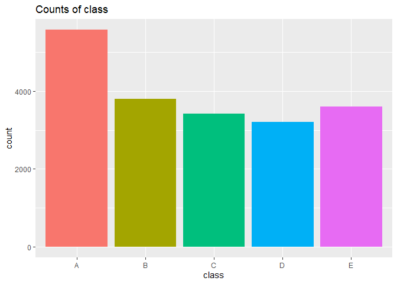

Load the dataset
----------------

Load libraries

    library(tidyverse)

    ## -- Attaching packages --------------------------------------- tidyverse 1.3.0 --

    ## v ggplot2 3.3.2     v purrr   0.3.4
    ## v tibble  3.0.1     v dplyr   1.0.0
    ## v tidyr   1.1.0     v stringr 1.4.0
    ## v readr   1.3.1     v forcats 0.5.0

    ## -- Conflicts ------------------------------------------ tidyverse_conflicts() --
    ## x dplyr::filter() masks stats::filter()
    ## x dplyr::lag()    masks stats::lag()

    library(caret)

    ## Loading required package: lattice

    ## 
    ## Attaching package: 'caret'

    ## The following object is masked from 'package:purrr':
    ## 
    ##     lift

    library(ggplot2)
    library(corrplot)

    ## corrplot 0.84 loaded

Load the data

    training = read_csv('https://d396qusza40orc.cloudfront.net/predmachlearn/pml-training.csv')

    ## Parsed with column specification:
    ## cols(
    ##   .default = col_double(),
    ##   user_name = col_character(),
    ##   cvtd_timestamp = col_character(),
    ##   new_window = col_character(),
    ##   kurtosis_roll_belt = col_character(),
    ##   kurtosis_picth_belt = col_character(),
    ##   kurtosis_yaw_belt = col_character(),
    ##   skewness_roll_belt = col_character(),
    ##   skewness_roll_belt.1 = col_character(),
    ##   skewness_yaw_belt = col_character(),
    ##   max_yaw_belt = col_character(),
    ##   min_yaw_belt = col_character(),
    ##   amplitude_yaw_belt = col_character(),
    ##   kurtosis_picth_arm = col_character(),
    ##   kurtosis_yaw_arm = col_character(),
    ##   skewness_pitch_arm = col_character(),
    ##   skewness_yaw_arm = col_character(),
    ##   kurtosis_yaw_dumbbell = col_character(),
    ##   skewness_yaw_dumbbell = col_character(),
    ##   kurtosis_roll_forearm = col_character(),
    ##   kurtosis_picth_forearm = col_character()
    ##   # ... with 8 more columns
    ## )

    ## See spec(...) for full column specifications.

    testing = read_csv('https://d396qusza40orc.cloudfront.net/predmachlearn/pml-testing.csv')

    ## Parsed with column specification:
    ## cols(
    ##   .default = col_logical(),
    ##   X1 = col_double(),
    ##   user_name = col_character(),
    ##   raw_timestamp_part_1 = col_double(),
    ##   raw_timestamp_part_2 = col_double(),
    ##   cvtd_timestamp = col_character(),
    ##   new_window = col_character(),
    ##   num_window = col_double(),
    ##   roll_belt = col_double(),
    ##   pitch_belt = col_double(),
    ##   yaw_belt = col_double(),
    ##   total_accel_belt = col_double(),
    ##   gyros_belt_x = col_double(),
    ##   gyros_belt_y = col_double(),
    ##   gyros_belt_z = col_double(),
    ##   accel_belt_x = col_double(),
    ##   accel_belt_y = col_double(),
    ##   accel_belt_z = col_double(),
    ##   magnet_belt_x = col_double(),
    ##   magnet_belt_y = col_double(),
    ##   magnet_belt_z = col_double()
    ##   # ... with 40 more columns
    ## )
    ## See spec(...) for full column specifications.

    dim(training)

    ## [1] 19622   160

    dim(testing)

    ## [1]  20 160

Inspect the data

    head(training)

    ## # A tibble: 6 x 160
    ##      X1 user_name raw_timestamp_p~ raw_timestamp_p~ cvtd_timestamp new_window
    ##   <dbl> <chr>                <dbl>            <dbl> <chr>          <chr>     
    ## 1     1 carlitos        1323084231           788290 05/12/2011 11~ no        
    ## 2     2 carlitos        1323084231           808298 05/12/2011 11~ no        
    ## 3     3 carlitos        1323084231           820366 05/12/2011 11~ no        
    ## 4     4 carlitos        1323084232           120339 05/12/2011 11~ no        
    ## 5     5 carlitos        1323084232           196328 05/12/2011 11~ no        
    ## 6     6 carlitos        1323084232           304277 05/12/2011 11~ no        
    ## # ... with 154 more variables: num_window <dbl>, roll_belt <dbl>,
    ## #   pitch_belt <dbl>, yaw_belt <dbl>, total_accel_belt <dbl>,
    ## #   kurtosis_roll_belt <chr>, kurtosis_picth_belt <chr>,
    ## #   kurtosis_yaw_belt <chr>, skewness_roll_belt <chr>,
    ## #   skewness_roll_belt.1 <chr>, skewness_yaw_belt <chr>, max_roll_belt <dbl>,
    ## #   max_picth_belt <dbl>, max_yaw_belt <chr>, min_roll_belt <dbl>,
    ## #   min_pitch_belt <dbl>, min_yaw_belt <chr>, amplitude_roll_belt <dbl>,
    ## #   amplitude_pitch_belt <dbl>, amplitude_yaw_belt <chr>,
    ## #   var_total_accel_belt <dbl>, avg_roll_belt <dbl>, stddev_roll_belt <dbl>,
    ## #   var_roll_belt <dbl>, avg_pitch_belt <dbl>, stddev_pitch_belt <dbl>,
    ## #   var_pitch_belt <dbl>, avg_yaw_belt <dbl>, stddev_yaw_belt <dbl>,
    ## #   var_yaw_belt <dbl>, gyros_belt_x <dbl>, gyros_belt_y <dbl>,
    ## #   gyros_belt_z <dbl>, accel_belt_x <dbl>, accel_belt_y <dbl>,
    ## #   accel_belt_z <dbl>, magnet_belt_x <dbl>, magnet_belt_y <dbl>,
    ## #   magnet_belt_z <dbl>, roll_arm <dbl>, pitch_arm <dbl>, yaw_arm <dbl>,
    ## #   total_accel_arm <dbl>, var_accel_arm <dbl>, avg_roll_arm <dbl>,
    ## #   stddev_roll_arm <dbl>, var_roll_arm <dbl>, avg_pitch_arm <dbl>,
    ## #   stddev_pitch_arm <dbl>, var_pitch_arm <dbl>, avg_yaw_arm <dbl>,
    ## #   stddev_yaw_arm <dbl>, var_yaw_arm <dbl>, gyros_arm_x <dbl>,
    ## #   gyros_arm_y <dbl>, gyros_arm_z <dbl>, accel_arm_x <dbl>, accel_arm_y <dbl>,
    ## #   accel_arm_z <dbl>, magnet_arm_x <dbl>, magnet_arm_y <dbl>,
    ## #   magnet_arm_z <dbl>, kurtosis_roll_arm <dbl>, kurtosis_picth_arm <chr>,
    ## #   kurtosis_yaw_arm <chr>, skewness_roll_arm <dbl>, skewness_pitch_arm <chr>,
    ## #   skewness_yaw_arm <chr>, max_roll_arm <dbl>, max_picth_arm <dbl>,
    ## #   max_yaw_arm <dbl>, min_roll_arm <dbl>, min_pitch_arm <dbl>,
    ## #   min_yaw_arm <dbl>, amplitude_roll_arm <dbl>, amplitude_pitch_arm <dbl>,
    ## #   amplitude_yaw_arm <dbl>, roll_dumbbell <dbl>, pitch_dumbbell <dbl>,
    ## #   yaw_dumbbell <dbl>, kurtosis_roll_dumbbell <dbl>,
    ## #   kurtosis_picth_dumbbell <dbl>, kurtosis_yaw_dumbbell <chr>,
    ## #   skewness_roll_dumbbell <dbl>, skewness_pitch_dumbbell <dbl>,
    ## #   skewness_yaw_dumbbell <chr>, max_roll_dumbbell <dbl>,
    ## #   max_picth_dumbbell <dbl>, max_yaw_dumbbell <dbl>, min_roll_dumbbell <dbl>,
    ## #   min_pitch_dumbbell <dbl>, min_yaw_dumbbell <dbl>,
    ## #   amplitude_roll_dumbbell <dbl>, amplitude_pitch_dumbbell <dbl>,
    ## #   amplitude_yaw_dumbbell <dbl>, total_accel_dumbbell <dbl>,
    ## #   var_accel_dumbbell <dbl>, avg_roll_dumbbell <dbl>,
    ## #   stddev_roll_dumbbell <dbl>, var_roll_dumbbell <dbl>, ...

Check for the response variable

    plot1 = training %>%
          count(classe) %>%
          ggplot(aes(factor(classe), n))+
          geom_col(aes(fill = classe))+
          theme(legend.position = 'none')+
          labs(title = 'Counts of class',
               x = 'class',
               y = 'count')

    plot1

There is a class imbalance on the response variable

Check for missing data

    num_missing = map_dbl(training, function(x) sum(is.na(x)))

    num_missing[num_missing != 0]

    ##       kurtosis_roll_belt      kurtosis_picth_belt        kurtosis_yaw_belt 
    ##                    19216                    19216                    19216 
    ##       skewness_roll_belt     skewness_roll_belt.1        skewness_yaw_belt 
    ##                    19216                    19216                    19216 
    ##            max_roll_belt           max_picth_belt             max_yaw_belt 
    ##                    19216                    19216                    19216 
    ##            min_roll_belt           min_pitch_belt             min_yaw_belt 
    ##                    19216                    19216                    19216 
    ##      amplitude_roll_belt     amplitude_pitch_belt       amplitude_yaw_belt 
    ##                    19216                    19216                    19216 
    ##     var_total_accel_belt            avg_roll_belt         stddev_roll_belt 
    ##                    19216                    19216                    19216 
    ##            var_roll_belt           avg_pitch_belt        stddev_pitch_belt 
    ##                    19216                    19216                    19216 
    ##           var_pitch_belt             avg_yaw_belt          stddev_yaw_belt 
    ##                    19216                    19216                    19216 
    ##             var_yaw_belt            var_accel_arm             avg_roll_arm 
    ##                    19216                    19216                    19216 
    ##          stddev_roll_arm             var_roll_arm            avg_pitch_arm 
    ##                    19216                    19216                    19216 
    ##         stddev_pitch_arm            var_pitch_arm              avg_yaw_arm 
    ##                    19216                    19216                    19216 
    ##           stddev_yaw_arm              var_yaw_arm        kurtosis_roll_arm 
    ##                    19216                    19216                    19294 
    ##       kurtosis_picth_arm         kurtosis_yaw_arm        skewness_roll_arm 
    ##                    19216                    19216                    19293 
    ##       skewness_pitch_arm         skewness_yaw_arm             max_roll_arm 
    ##                    19216                    19216                    19216 
    ##            max_picth_arm              max_yaw_arm             min_roll_arm 
    ##                    19216                    19216                    19216 
    ##            min_pitch_arm              min_yaw_arm       amplitude_roll_arm 
    ##                    19216                    19216                    19216 
    ##      amplitude_pitch_arm        amplitude_yaw_arm   kurtosis_roll_dumbbell 
    ##                    19216                    19216                    19221 
    ##  kurtosis_picth_dumbbell    kurtosis_yaw_dumbbell   skewness_roll_dumbbell 
    ##                    19218                    19216                    19220 
    ##  skewness_pitch_dumbbell    skewness_yaw_dumbbell        max_roll_dumbbell 
    ##                    19217                    19216                    19216 
    ##       max_picth_dumbbell         max_yaw_dumbbell        min_roll_dumbbell 
    ##                    19216                    19221                    19216 
    ##       min_pitch_dumbbell         min_yaw_dumbbell  amplitude_roll_dumbbell 
    ##                    19216                    19221                    19216 
    ## amplitude_pitch_dumbbell   amplitude_yaw_dumbbell       var_accel_dumbbell 
    ##                    19216                    19221                    19216 
    ##        avg_roll_dumbbell     stddev_roll_dumbbell        var_roll_dumbbell 
    ##                    19216                    19216                    19216 
    ##       avg_pitch_dumbbell    stddev_pitch_dumbbell       var_pitch_dumbbell 
    ##                    19216                    19216                    19216 
    ##         avg_yaw_dumbbell      stddev_yaw_dumbbell         var_yaw_dumbbell 
    ##                    19216                    19216                    19216 
    ##    kurtosis_roll_forearm   kurtosis_picth_forearm     kurtosis_yaw_forearm 
    ##                    19216                    19216                    19216 
    ##    skewness_roll_forearm   skewness_pitch_forearm     skewness_yaw_forearm 
    ##                    19216                    19216                    19216 
    ##         max_roll_forearm        max_picth_forearm          max_yaw_forearm 
    ##                    19216                    19216                    19216 
    ##         min_roll_forearm        min_pitch_forearm          min_yaw_forearm 
    ##                    19216                    19216                    19216 
    ##   amplitude_roll_forearm  amplitude_pitch_forearm    amplitude_yaw_forearm 
    ##                    19216                    19216                    19216 
    ##        var_accel_forearm         avg_roll_forearm      stddev_roll_forearm 
    ##                    19216                    19216                    19216 
    ##         var_roll_forearm        avg_pitch_forearm     stddev_pitch_forearm 
    ##                    19216                    19216                    19216 
    ##        var_pitch_forearm          avg_yaw_forearm       stddev_yaw_forearm 
    ##                    19216                    19216                    19216 
    ##          var_yaw_forearm 
    ##                    19216

There were a lot of variables with missing values or no values ot all

Data Preprocessing
------------------

### Remove non-helpful features

Remove features with many missing values

    col_missing = names(num_missing[num_missing != 0])

    training = training %>%
          select(-col_missing)

    ## Note: Using an external vector in selections is ambiguous.
    ## i Use `all_of(col_missing)` instead of `col_missing` to silence this message.
    ## i See <https://tidyselect.r-lib.org/reference/faq-external-vector.html>.
    ## This message is displayed once per session.

Remove near zero variance

    nz_cols = nearZeroVar(training)

Check the columns with near zero variance

    names(training)[nz_cols]

    ## [1] "new_window"

Remove those near zero variance values

    training = training[,-nz_cols]

Find high correlation

    numeric_train = map_lgl(training, is.numeric)
    numeric_train = training[,numeric_train]

    high_cor = findCorrelation(cor(numeric_train), cutoff = .75) 

    names(training)[high_cor]

    ##  [1] "accel_belt_x"        "cvtd_timestamp"      "gyros_belt_z"       
    ##  [4] "gyros_arm_z"         "pitch_belt"          "accel_dumbbell_x"   
    ##  [7] "gyros_belt_y"        "accel_belt_y"        "accel_dumbbell_y"   
    ## [10] "gyros_dumbbell_z"    "accel_dumbbell_z"    "magnet_dumbbell_x"  
    ## [13] "gyros_arm_y"         "gyros_dumbbell_y"    "accel_arm_x"        
    ## [16] "accel_arm_z"         "accel_belt_z"        "gyros_forearm_z"    
    ## [19] "yaw_dumbbell"        "total_accel_forearm" "gyros_dumbbell_x"   
    ## [22] "yaw_arm"

Remove those that are highly correlated

    training = training[,-high_cor]

Check the structure of the remaining trianing set

    str(training)

    ## tibble [19,622 x 37] (S3: tbl_df/tbl/data.frame)
    ##  $ X1                  : num [1:19622] 1 2 3 4 5 6 7 8 9 10 ...
    ##  $ user_name           : chr [1:19622] "carlitos" "carlitos" "carlitos" "carlitos" ...
    ##  $ raw_timestamp_part_1: num [1:19622] 1.32e+09 1.32e+09 1.32e+09 1.32e+09 1.32e+09 ...
    ##  $ raw_timestamp_part_2: num [1:19622] 788290 808298 820366 120339 196328 ...
    ##  $ num_window          : num [1:19622] 11 11 11 12 12 12 12 12 12 12 ...
    ##  $ roll_belt           : num [1:19622] 1.41 1.41 1.42 1.48 1.48 1.45 1.42 1.42 1.43 1.45 ...
    ##  $ yaw_belt            : num [1:19622] -94.4 -94.4 -94.4 -94.4 -94.4 -94.4 -94.4 -94.4 -94.4 -94.4 ...
    ##  $ total_accel_belt    : num [1:19622] 3 3 3 3 3 3 3 3 3 3 ...
    ##  $ gyros_belt_x        : num [1:19622] 0 0.02 0 0.02 0.02 0.02 0.02 0.02 0.02 0.03 ...
    ##  $ magnet_belt_x       : num [1:19622] -3 -7 -2 -6 -6 0 -4 -2 1 -3 ...
    ##  $ magnet_belt_y       : num [1:19622] 599 608 600 604 600 603 599 603 602 609 ...
    ##  $ magnet_belt_z       : num [1:19622] -313 -311 -305 -310 -302 -312 -311 -313 -312 -308 ...
    ##  $ roll_arm            : num [1:19622] -128 -128 -128 -128 -128 -128 -128 -128 -128 -128 ...
    ##  $ pitch_arm           : num [1:19622] 22.5 22.5 22.5 22.1 22.1 22 21.9 21.8 21.7 21.6 ...
    ##  $ total_accel_arm     : num [1:19622] 34 34 34 34 34 34 34 34 34 34 ...
    ##  $ gyros_arm_x         : num [1:19622] 0 0.02 0.02 0.02 0 0.02 0 0.02 0.02 0.02 ...
    ##  $ accel_arm_y         : num [1:19622] 109 110 110 111 111 111 111 111 109 110 ...
    ##  $ magnet_arm_x        : num [1:19622] -368 -369 -368 -372 -374 -369 -373 -372 -369 -376 ...
    ##  $ magnet_arm_y        : num [1:19622] 337 337 344 344 337 342 336 338 341 334 ...
    ##  $ magnet_arm_z        : num [1:19622] 516 513 513 512 506 513 509 510 518 516 ...
    ##  $ roll_dumbbell       : num [1:19622] 13.1 13.1 12.9 13.4 13.4 ...
    ##  $ pitch_dumbbell      : num [1:19622] -70.5 -70.6 -70.3 -70.4 -70.4 ...
    ##  $ total_accel_dumbbell: num [1:19622] 37 37 37 37 37 37 37 37 37 37 ...
    ##  $ magnet_dumbbell_y   : num [1:19622] 293 296 298 303 292 294 295 300 292 291 ...
    ##  $ magnet_dumbbell_z   : num [1:19622] -65 -64 -63 -60 -68 -66 -70 -74 -65 -69 ...
    ##  $ roll_forearm        : num [1:19622] 28.4 28.3 28.3 28.1 28 27.9 27.9 27.8 27.7 27.7 ...
    ##  $ pitch_forearm       : num [1:19622] -63.9 -63.9 -63.9 -63.9 -63.9 -63.9 -63.9 -63.8 -63.8 -63.8 ...
    ##  $ yaw_forearm         : num [1:19622] -153 -153 -152 -152 -152 -152 -152 -152 -152 -152 ...
    ##  $ gyros_forearm_x     : num [1:19622] 0.03 0.02 0.03 0.02 0.02 0.02 0.02 0.02 0.03 0.02 ...
    ##  $ gyros_forearm_y     : num [1:19622] 0 0 -0.02 -0.02 0 -0.02 0 -0.02 0 0 ...
    ##  $ accel_forearm_x     : num [1:19622] 192 192 196 189 189 193 195 193 193 190 ...
    ##  $ accel_forearm_y     : num [1:19622] 203 203 204 206 206 203 205 205 204 205 ...
    ##  $ accel_forearm_z     : num [1:19622] -215 -216 -213 -214 -214 -215 -215 -213 -214 -215 ...
    ##  $ magnet_forearm_x    : num [1:19622] -17 -18 -18 -16 -17 -9 -18 -9 -16 -22 ...
    ##  $ magnet_forearm_y    : num [1:19622] 654 661 658 658 655 660 659 660 653 656 ...
    ##  $ magnet_forearm_z    : num [1:19622] 476 473 469 469 473 478 470 474 476 473 ...
    ##  $ classe              : chr [1:19622] "A" "A" "A" "A" ...
    ##  - attr(*, "problems")= tibble [182 x 5] (S3: tbl_df/tbl/data.frame)
    ##   ..$ row     : int [1:182] 2231 2231 2255 2255 2282 2282 2314 2314 2422 2422 ...
    ##   ..$ col     : chr [1:182] "kurtosis_roll_arm" "skewness_roll_arm" "kurtosis_roll_arm" "skewness_roll_arm" ...
    ##   ..$ expected: chr [1:182] "a double" "a double" "a double" "a double" ...
    ##   ..$ actual  : chr [1:182] "#DIV/0!" "#DIV/0!" "#DIV/0!" "#DIV/0!" ...
    ##   ..$ file    : chr [1:182] "'https://d396qusza40orc.cloudfront.net/predmachlearn/pml-training.csv'" "'https://d396qusza40orc.cloudfront.net/predmachlearn/pml-training.csv'" "'https://d396qusza40orc.cloudfront.net/predmachlearn/pml-training.csv'" "'https://d396qusza40orc.cloudfront.net/predmachlearn/pml-training.csv'" ...

Can remove ID and user name

    training = training %>%
          select(-X1, -user_name)

Fix the test set to have the same structure as training set

    problem_id = testing$problem_id

    testing = testing %>%
          select(-col_missing) %>%
          select(-nz_cols) %>%
          select(-high_cor) %>%
          select(-X1, -user_name, -problem_id)

    ## Note: Using an external vector in selections is ambiguous.
    ## i Use `all_of(nz_cols)` instead of `nz_cols` to silence this message.
    ## i See <https://tidyselect.r-lib.org/reference/faq-external-vector.html>.
    ## This message is displayed once per session.

    ## Note: Using an external vector in selections is ambiguous.
    ## i Use `all_of(high_cor)` instead of `high_cor` to silence this message.
    ## i See <https://tidyselect.r-lib.org/reference/faq-external-vector.html>.
    ## This message is displayed once per session.

Model fitting
-------------

Split training into testing and training

    set.seed(1111)
    in_training = createDataPartition(training$classe, p = .75, list = F)

    training_sample_train = training[in_training,]
    training_sample_test = training[-in_training,]
    dim(training_sample_train)

    ## [1] 14718    35

    dim(training_sample_test)

    ## [1] 4904   35

Fit a gbm model

    gbm_model = train(classe ~., data= training_sample_train, method = 'gbm')

    gbm_pred = predict(gbm_model, training_sample_test)
    table(gbm_pred, training_sample_test$classe)

    ##         
    ## gbm_pred    A    B    C    D    E
    ##        A 1395    0    0    0    0
    ##        B    0  949    3    0    0
    ##        C    0    0  851    0    0
    ##        D    0    0    1  800    1
    ##        E    0    0    0    4  900

    sum(gbm_pred == training_sample_test$classe)/length(gbm_pred)

    ## [1] 0.9981648

99% accuracy

    testing_pred = predict(gbm_model, testing)
    test_output = data.frame(problem_id = problem_id, classe = testing_pred)

I already tried it on coursera and got 100% accouracy
